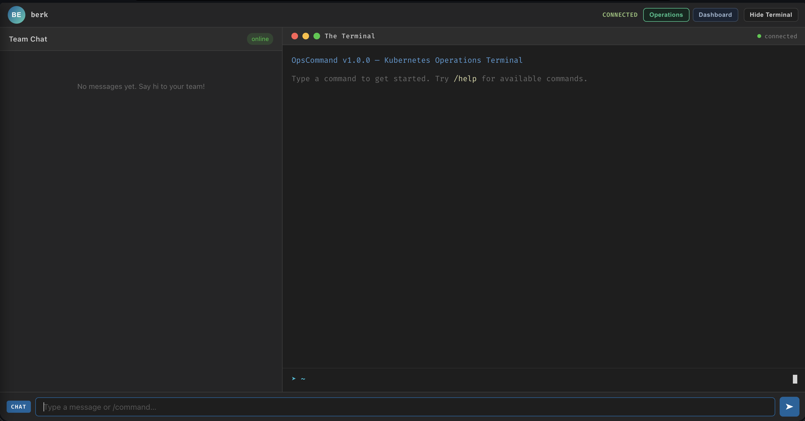
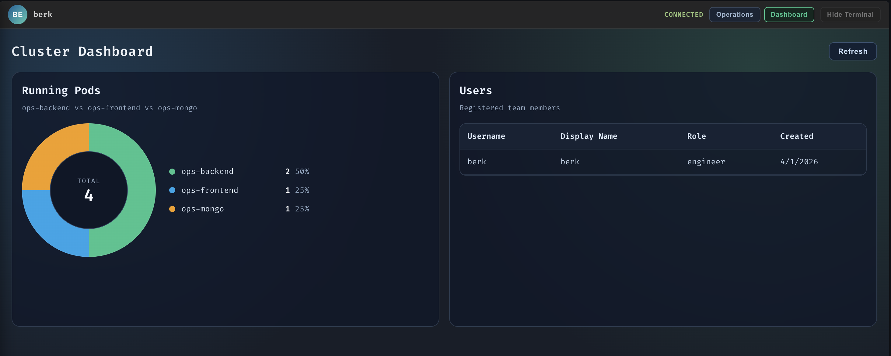

# OpsCommand 🚀

A collaborative DevOps command platform that combines team chat with real-time Kubernetes cluster management. Built for engineering teams who need to monitor, debug, and operate their Kubernetes infrastructure from a unified interface.

## Features

- **Team Chat**: Real-time messaging for team collaboration with persistent chat history
- **Ops Terminal**: Execute Kubernetes operations via slash commands with instant feedback
- **User Authentication**: Secure JWT-based authentication with user profiles
- **Live Cluster Management**: Direct integration with Kubernetes API for pod operations
- **Command System**: Extensible plugin-based command architecture
- **Real-time Updates**: WebSocket-powered instant communication
- **Message Persistence**: MongoDB-backed chat and ops history

## Screenshots

### Operations View



### Dashboard View



## Architecture

```
┌─────────────┐      WebSocket      ┌─────────────┐      K8s API     ┌──────────────┐
│   React     │◄────────────────────│   Node.js   │◄─────────────────│  Kubernetes  │
│  Frontend   │      Socket.io      │   Backend   │   @kubernetes/   │   Cluster    │
│   (Vite)    │                     │  (Express)  │   client-node    │              │
└─────────────┘                     └─────────────┘                  └──────────────┘
                                            │
                                            │ Mongoose
                                            ▼
                                     ┌─────────────┐
                                     │   MongoDB   │
                                     │  (Messages) │
                                     └─────────────┘
```

## Tech Stack

### Frontend
- **React 19** - UI framework
- **Vite** - Build tool and dev server
- **Socket.io Client** - Real-time communication
- **Axios** - HTTP client for API requests

### Backend
- **Node.js + Express 5** - Web server
- **Socket.io** - WebSocket server for real-time events
- **Mongoose** - MongoDB ODM
- **@kubernetes/client-node** - Kubernetes API client
- **JWT + bcryptjs** - Authentication and password hashing

### Infrastructure
- **MongoDB 6.0** - Message persistence
- **Prometheus** - Metrics collection and alerting
- **Grafana** - Metrics dashboards and visualization
- **Kubernetes** - Container orchestration
- **Docker** - Containerization
- **Skaffold** - Development workflow automation
- **Kind** - Local Kubernetes cluster

## Prerequisites

- **Node.js** 18+ and npm
- **Docker** and Docker Compose
- **kubectl** - Kubernetes CLI
- **Skaffold** - Development workflow tool
- **Kind** (optional) - For local Kubernetes cluster

## Installation & Setup

### 1. Clone the Repository
```bash
git clone <repository-url>
cd ops-command
```

### 2. Install Dependencies

**Frontend:**
```bash
cd frontend
npm install
```

**Backend:**
```bash
cd backend
npm install
```

### 3. Environment Configuration

The application uses the following environment variables:

**Backend:**
- `PORT` - Server port (default: 4000)
- `MONGO_URI` - MongoDB connection string (default: mongodb://localhost:27017/opscommand)
- `JWT_SECRET` - Secret key for JWT tokens

**Frontend:**
- `VITE_BACKEND_URL` - Backend API URL (default: http://opscommand.local)

## Development

### Local Development (Docker Compose)

Run the full stack locally with hot-reload:

```bash
docker-compose up
```

This starts:
- Frontend on http://localhost:5173
- Backend on http://localhost:4000
- MongoDB on localhost:27017
- Prometheus on http://localhost:9090
- Grafana on http://localhost:3000
- Node Exporter on localhost:9100 (for system/host metrics)

### Monitoring Stack

The backend exposes Prometheus metrics at:

- `GET http://localhost:4000/metrics`

Included custom metrics:

- `opscommand_commands_total{status="success|error"}`
- `opscommand_command_duration_seconds` (histogram)

Included default Node.js/process metrics (via `prom-client`):

- CPU usage (process CPU seconds)
- memory usage (resident/heap)
- event loop lag and process/runtime metrics

Prometheus is preconfigured to scrape the app every 5 seconds.

Grafana is preconfigured with:

- Prometheus data source
- `OpsCommand Monitoring` dashboard
    - command rate
    - error rate
    - p95 latency

Default Grafana credentials:

- username: `admin`
- password: `admin`

Example PromQL queries:

```promql
# Command rate (commands per second)
sum(rate(opscommand_commands_total[1m]))

# Error rate (%)
100 * sum(rate(opscommand_commands_total{status="error"}[5m]))
    / clamp_min(sum(rate(opscommand_commands_total[5m])), 0.001)

# Command latency p95 (seconds)
histogram_quantile(0.95, sum(rate(opscommand_command_duration_seconds_bucket[5m])) by (le))
```

Alert rules are included in Prometheus for:

- High command error rate
- High p95 command latency

### Kubernetes Development (Skaffold)

For development with automatic rebuilds and redeploys:

```bash
# Create a local Kind cluster (if needed)
kind create cluster --config kind-config.yaml

# Start Skaffold in dev mode
skaffold dev
```

Skaffold will:
1. Build Docker images for frontend and backend
2. Deploy all Kubernetes manifests from `k8s/`
3. Watch for file changes and auto-rebuild/redeploy
4. Stream logs from all pods

Access the application at http://opscommand.local (configure your `/etc/hosts` if needed).

## Deployment

### Kubernetes Deployment

The `k8s/` directory contains all Kubernetes manifests:

- **backend.yaml** - Backend Deployment and Service
- **frontend.yaml** - Frontend Deployment and Service
- **mongo.yaml** - MongoDB StatefulSet with persistent volume
- **configmap.yaml** - Configuration data
- **secret.yaml** - Sensitive credentials (base64 encoded)
- **rbac.yaml** - Service Account and RBAC for K8s API access
- **ingress.yaml** - Ingress rules for external access

Deploy to your cluster:

```bash
kubectl apply -f k8s/
```

### Production Considerations

1. **Secrets Management**: Replace the example secrets with real credentials
2. **Ingress**: Configure your ingress controller and TLS certificates
3. **RBAC**: Review and tighten ServiceAccount permissions as needed
4. **Persistence**: Ensure MongoDB PersistentVolume is properly backed up
5. **Environment Variables**: Configure production URLs and secrets

## Available Commands

The OpsBot responds to slash commands in the terminal:

| Command | Description | Usage |
|---------|-------------|-------|
| `/help` | Lists all available commands | `/help` |
| `/status` | Shows cluster status and pod count | `/status` |
| `/logs` | Fetches the last 20 lines of pod logs | `/logs <pod-name>` |
| `/restart` | Triggers a rollout restart for a deployment | `/restart <deployment-name>` |
| `/visualize` | Shows ASCII health visualization for backend and pods | `/visualize` |
| `/userlist` | Lists users and their permissions in ASCII table format | `/userlist` |

### Adding New Commands

Commands are auto-loaded from `backend/commands/`. To add a new command:

1. Create a new file in `backend/commands/`, e.g., `scale.js`
2. Export a module with this structure:

```javascript
module.exports = {
    name: '/scale',
    description: 'Scales a deployment to N replicas',
    execute: async (data, context) => {
        const { socket, k8sApi, k8sAppsApi } = context;
        
        // Your command logic here
        socket.emit('receive_message', {
            sender: 'OpsBot',
            text: 'Response message',
            type: 'system'
        });
    }
};
```

3. Restart the backend - the command will be automatically loaded!

## Project Structure

```
OpsCommand/
├── assets/                     # README screenshots
│   ├── dashboard.png
│   └── operations.png
├── backend/                    # Node.js backend application
│   ├── commands/               # OpsBot command plugins
│   │   ├── clear.js
│   │   ├── help.js
│   │   ├── logs.js
│   │   ├── restart.js
│   │   ├── status.js
│   │   ├── userlist.js
│   │   └── visualize.js
│   ├── config/
│   │   └── passport.js
│   ├── middleware/
│   │   └── auth.js
│   ├── models/
│   │   └── User.js
│   ├── routes/
│   │   └── auth.js
│   ├── Dockerfile
│   ├── package.json
│   └── server.js
├── frontend/                   # React frontend (Vite)
│   ├── public/
│   │   └── vite.svg
│   ├── src/
│   │   ├── assets/
│   │   │   └── react.svg
│   │   ├── components/
│   │   │   ├── Dashboard.css
│   │   │   ├── Dashboard.jsx
│   │   │   ├── LoginScreen.css
│   │   │   ├── LoginScreen.jsx
│   │   │   ├── OpsTerminal.css
│   │   │   ├── OpsTerminal.jsx
│   │   │   ├── ProfileSidebar.css
│   │   │   ├── ProfileSidebar.jsx
│   │   │   ├── TeamChat.css
│   │   │   └── TeamChat.jsx
│   │   ├── config/
│   │   │   └── runtime.js
│   │   ├── App.css
│   │   ├── App.jsx
│   │   ├── index.css
│   │   └── main.jsx
│   ├── Dockerfile
│   ├── eslint.config.js
│   ├── index.html
│   ├── package.json
│   ├── README.md
│   └── vite.config.js
├── k8s/                        # Kubernetes manifests
│   ├── backend.yaml
│   ├── configmap.yaml
│   ├── frontend.yaml
│   ├── ingress.yaml
│   ├── mongo.yaml
│   ├── rbac.yaml
│   └── secret.yaml
├── docker-compose.yml
├── kind-config.yaml
├── requirements.md
├── skaffold.yaml
├── system_modeling.md
└── README.md
```

## Security

- **Authentication**: JWT-based authentication with bcrypt password hashing
- **Kubernetes RBAC**: Backend runs with a ServiceAccount with limited permissions
- **CORS**: Configured to only allow requests from known origins
- **Environment Variables**: Sensitive data stored in Kubernetes Secrets

## Contributing

To contribute to OpsCommand:

1. Fork the repository
2. Create a feature branch (`git checkout -b feature/amazing-feature`)
3. Commit your changes (`git commit -m 'Add amazing feature'`)
4. Push to the branch (`git push origin feature/amazing-feature`)
5. Open a Pull Request

## License

This project is open source and available under the [MIT License](LICENSE).

## Support

For questions, issues, or feature requests, please open an issue on the GitHub repository.

---

Built with ❤️ for DevOps teams who value collaboration and efficiency.
