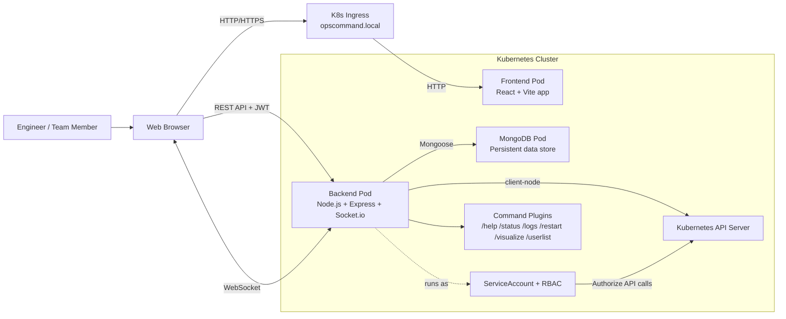
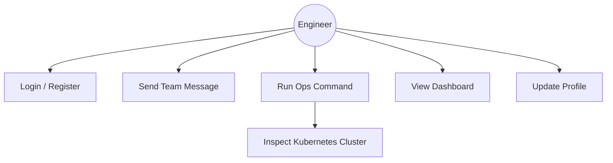
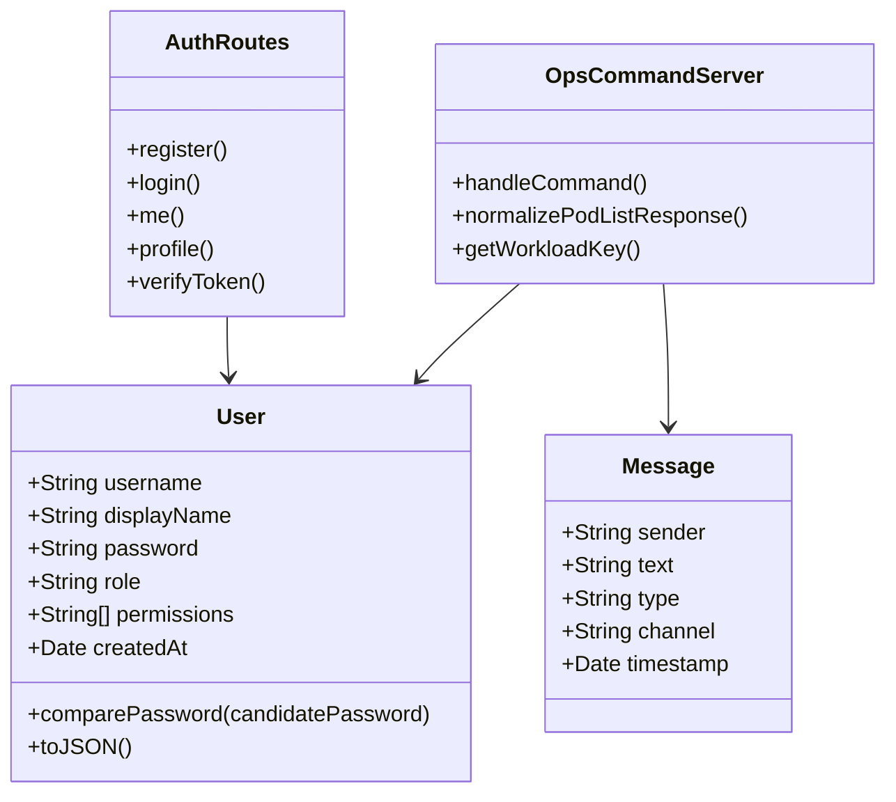
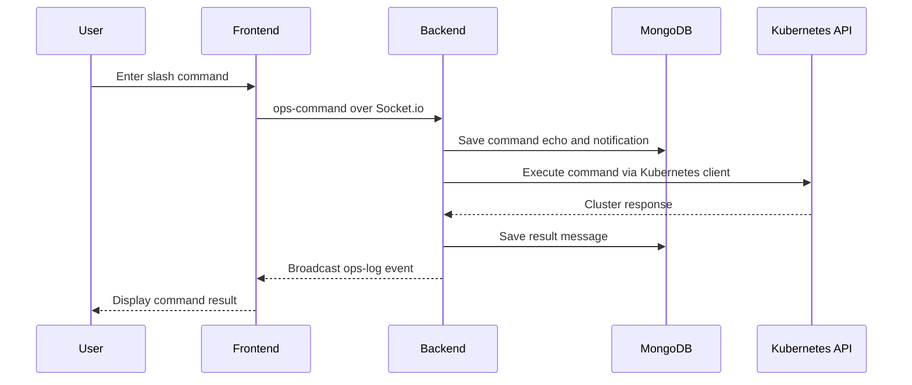

# Software Engineering Project Report

## Title Page

Project Title: 
*Collaborative DevOps & Kubernetes Management Platform*

Student Names: 
_Kamil Berk Ünsal
Doğukan Sağlık
Alperen Gül_

Student IDs In order: 
_230201045
230201052
230201008_

Course Name: 
_SENG 204 (2) [360911] Software Engineering_

Instructor Name: 
_Asst. Prof. Dr. NIAYESH GHARAEI_

Submission Date:
_06.04.2026_

## Abstract

OpsCommand is a collaborative DevOps command platform that unifies team chat, operational messaging, and Kubernetes cluster management in a single web application. The project addresses the common problem of switching between chat tools, dashboards, and terminal sessions during incident response and routine operations. Its proposed solution combines a React frontend, an Express and Socket.io backend, MongoDB persistence, and Kubernetes API access through a service account with RBAC permissions. Users authenticate with JWT-based login, communicate in real time through WebSockets, and issue slash commands such as status checks, log retrieval, rollout restarts, and cluster visualization. The backend stores chat and operational history, while the dashboard summarizes cluster state and registered users. The resulting system improves coordination by centralizing communication and operational control. Manual validation of the implemented workflows shows that the platform supports authentication, live messaging, command execution, and dashboard inspection in a consistent interface.

## Introduction

Modern engineering teams often use separate systems for team communication, application monitoring, and cluster operations. This separation increases context switching and slows down incident response, especially when developers must coordinate quickly while also interacting with Kubernetes resources. OpsCommand was developed to reduce this fragmentation by combining collaboration and operational control into one environment.

The problem addressed by this project is the lack of a lightweight, integrated workspace that allows engineers to chat, inspect cluster health, and execute operational commands without leaving the application. Existing solutions tend to focus on either communication or infrastructure management, but not both in one workflow.

The project objectives are to provide secure user authentication, persistent team chat, real-time command execution, Kubernetes-aware operational visibility, and a dashboard for cluster and user overview. The system scope includes authenticated web access, WebSocket-based collaboration, MongoDB-backed persistence, and Kubernetes integration through the backend service. The main limitations are that the platform is designed for Kubernetes environments, depends on a configured cluster and ingress workflow, and currently uses a small command set focused on core operational actions.

## Literature Review

OpsCommand draws on patterns found in team communication platforms, web-based operational dashboards, and Kubernetes management tools. Messaging systems such as Slack demonstrate the value of real-time collaboration, while Kubernetes Dashboard and Lens show the usefulness of direct cluster visibility. However, these tools are typically separate, forcing teams to move between communication and execution contexts.

The gap addressed by this project is the integration of collaborative chat and operational commands within a single interface. Rather than replacing established tools, OpsCommand combines a chat stream, an ops terminal, and a cluster overview so that team coordination and infrastructure actions can happen in the same session.

## System Overview

OpsCommand is a full-stack web application with three main layers: a React frontend, a Node.js and Express backend, and a Kubernetes-backed operational environment. The frontend provides the dashboard, chat panel, ops terminal, and profile controls. The backend handles authentication, real-time events, command dispatch, message storage, and cluster API calls. MongoDB stores user and message data, while Kubernetes provides the operational target for commands such as logs, restart, and status inspection.

### System Architecture Diagram

### Main Components

- Frontend: React application with login screen, dashboard, team chat, ops terminal, and profile sidebar.
- Backend: Express API, Socket.io server, auth routes, command loader, dashboard aggregation, and message persistence.
- Data layer: MongoDB collections for users and messages.
- Cluster integration: Kubernetes client access through service account credentials and RBAC rules.

## Requirements Specification

### Functional Requirements

- Users must be able to register, log in, and retrieve their current profile.
- Users must be able to update their display name and password.
- The system must support real-time team chat messages.
- The system must accept slash commands in the ops terminal.
- The backend must execute supported operational commands against the Kubernetes cluster.
- The system must store chat and ops history in MongoDB.
- The dashboard must display running pod counts and registered users.
- The system must support persistent sessions through JWT authentication.

### Non-Functional Requirements

- Security: Passwords must be hashed, and API access must be protected with JWTs.
- Performance: Real-time messaging should propagate with low latency using WebSockets.
- Reliability: MongoDB connection retries and backend startup resilience should reduce transient failures.
- Usability: The interface should keep chat and terminal interaction in one workspace.
- Portability: The system should run in Docker Compose and Kubernetes-based development environments.
- Maintainability: Command execution should be modular through the backend command loader.

## System Design

### Use Case Diagram

### Class Diagram

### Sequence Diagram

### Database Design

OpsCommand currently uses two core data models:

- User collection: stores username, display name, password hash, role, permissions, and creation date.
- Message collection: stores sender, text, type, channel, and timestamp for chat and ops history.

The User model hashes passwords before save and excludes the password field from JSON output. The Message model is used to persist both team chat and operational logs.

## Methodology / Development Process

The project follows an iterative implementation approach rather than a strict linear waterfall process. Core capabilities were developed in increments: authentication, chat, command handling, Kubernetes integration, dashboarding, and UI refinement. This incremental approach allowed each layer to be validated against the next layer before expanding the system.

Development phases included environment setup, backend API and socket implementation, frontend screen composition, command plugin wiring, dashboard aggregation, and deployment configuration for Docker Compose and Kubernetes.

## Implementation

### Technologies and Tools Used

- Frontend: React 19, Vite, Axios, Socket.io client.
- Backend: Node.js, Express 5, Socket.io, Mongoose, bcryptjs, jsonwebtoken.
- Cluster integration: @kubernetes/client-node.
- Infrastructure: Docker, Docker Compose, Kubernetes, Skaffold, Kind.

### System Modules and Structure

- frontend/src/App.jsx: orchestrates authentication, chat, terminal, and dashboard views.
- frontend/src/components/: contains the dashboard, login screen, team chat, ops terminal, and profile sidebar UI.
- backend/server.js: initializes Express, Socket.io, MongoDB, and Kubernetes clients; loads commands; routes events.
- backend/routes/auth.js: provides register, login, me, and profile endpoints.
- backend/models/User.js: defines the user schema, password hashing, and permissions.
- backend/commands/: contains slash-command plugins loaded dynamically at runtime.

### Key Algorithms or Logic

- Token-based authentication: login and profile requests are validated using JWTs.
- Command routing: messages beginning with `/` are dispatched to the ops command handler.
- Dynamic plugin loading: backend command files are discovered at startup and mapped by command name.
- Dashboard aggregation: pod counts are normalized from Kubernetes API responses and grouped by service label or pod name.
- Real-time event broadcast: Socket.io emits chat and ops updates to all connected clients.

## Testing and Evaluation

### Test Cases and Scenarios

- Register a new user with valid credentials.
- Reject registration when username, display name, or password is missing.
- Reject login with invalid credentials.
- Load an authenticated profile using a stored token.
- Send a regular chat message and confirm it appears in the chat stream.
- Send a slash command and confirm it appears in the ops log.
- Verify that supported commands return Kubernetes-aware results.
- Refresh the dashboard and confirm pod counts and user data are displayed.

### Testing Methods

- Manual functional testing of authentication, messaging, and dashboard flows.
- Integration testing through browser interaction with the running frontend and backend.
- Environment validation using Docker Compose and Kubernetes-based deployment workflows.

### Results and Screenshots

The implemented system demonstrates successful login, persistent messaging, command execution, and dashboard viewing in a unified interface. Visual confirmation is available through the project screenshots stored in the repository assets directory.

## Results and Discussion

The main outcome of the project is a working DevOps collaboration platform that reduces the need to switch between separate tools for communication and operations. The system performs well for its intended scope because the frontend, backend, and cluster interactions are separated into clear responsibilities and connected through simple real-time interfaces.

The implementation meets the primary objectives of combining chat and operational control, supporting authenticated access, and exposing cluster state through a dashboard. The current limitations are the absence of a dedicated automated test suite, a relatively small command set, and dependence on a correctly configured Kubernetes environment and ingress setup. Even with these constraints, the project demonstrates a practical workflow for team-based operational command execution.

## Conclusion and Future Work

OpsCommand successfully integrates collaboration and Kubernetes operations in one application. The project provides secure authentication, real-time messaging, command-based cluster interaction, and persistent records for both chat and ops activity. These features support a more efficient incident-response and DevOps workflow.

Future improvements could include a broader command catalog, automated unit and integration testing, role-aware UI restrictions, richer dashboard analytics, notification support, audit trails for operational actions, and stronger production deployment hardening such as TLS and secret-management integration.

## References

[1] React Team, "React Documentation," 2026. [Online]. Available: https://react.dev/

[2] Vite Team, "Vite Documentation," 2026. [Online]. Available: https://vite.dev/

[3] Express.js, "Express Documentation," 2026. [Online]. Available: https://expressjs.com/

[4] Socket.IO, "Socket.IO Documentation," 2026. [Online]. Available: https://socket.io/docs/v4/

[5] MongoDB, "Mongoose Documentation," 2026. [Online]. Available: https://mongoosejs.com/

[6] Kubernetes Authors, "Kubernetes Documentation," 2026. [Online]. Available: https://kubernetes.io/docs/

[7] Kubernetes JavaScript Client, "@kubernetes/client-node," 2026. [Online]. Available: https://github.com/kubernetes-client/javascript

[8] JWT.io, "JSON Web Token Introduction," 2026. [Online]. Available: https://jwt.io/introduction

## Appendix

### Additional Notes

- The backend command system loads command modules from backend/commands/ at startup.
